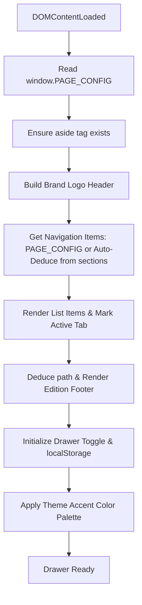

# Navigation Drawer & Theme Specification

This document details the generic architecture, configuration schemas, dynamic auto-deduction algorithms, and state management mechanisms for a reusable client-side navigation side drawer and theme accent engine.

---

## 1. Overview
The drawer builder utility dynamically compiles a collapsible sidebar drawer interface. It controls page-level branding headers, navigation menus, collapsible memory transitions, and active status tracking while mapping path parameters to active theme accent definitions.



---

## 2. Configuration Schema (`window.PAGE_CONFIG`)
Individual pages declare a configuration object before loading the drawer module to define explicit layout and routing properties:

```javascript
window.PAGE_CONFIG = {
    domain: "curriculum_domain_or_module_id",
    logo: { 
        main: "PrimaryBrand", 
        accent: "AccentStyle", 
        sub: "SubHeadingText" 
    },
    navigation: [
        { 
            label: "Tab Navigation Label", 
            desc: "Description snippet", 
            href: "#sectionAnchor" 
        }
    ]
};
```

### Properties:
- **`domain`** (Optional): A string token representing the active theme category or namespace, used to resolve active color tokens.
- **`logo`** (Optional): Custom branding values:
  - `main`: Title prefix.
  - `accent`: Colored suffix.
  - `sub`: Auxiliary label below title.
- **`navigation`** (Optional): An array of tab links representing page modules. If omitted, the menu structure will be auto-deduced from on-page elements.

---

## 3. Dynamic Rendering & Auto-Deduction Rules

### A. Automatic Logo Fallback
If `logo` parameters are not configured, the builder scrapes context from the page:
1. Locates the primary heading element: `document.querySelector('header h1')`.
2. Splits the string by space characters:
   - First word matches `mainWord`.
   - Remaining words are combined into `accentWord`.
3. Defaults the sub-heading caption to a generic label (e.g., `"Module Explorer"`).

### B. Automatic Navigation Fallback
If `navigation` array is not configured, the builder automatically maps the page structure:
1. Queries all section blocks in the content area: `document.querySelectorAll('main section')`.
2. Iterates over sections to build tab entries:
   - **`href`**: Points to the section's HTML ID attribute (`#${sectionId}`).
   - **`label`**: Extracted from the section's secondary heading: `.querySelector('h2')`.
   - **`desc`**: Extracted from helper description badges: `.querySelector('.section-tag')`.

### C. Active Tab Selection
The current active sidebar item is resolved programmatically:
1. Matches individual items' `href` value against the browser address bar anchor (`window.location.hash`).
2. If no hash exists, the first navigation item (index `0`) is set active.
3. Binds click event handlers to sync active states on selection changes.

---

## 4. Layout Mechanics & Sidebar Footer

### A. Non-blocking Stylesheet & Font Loading
To prevent Flash of Unstyled Content (FOUC), the script dynamically verify links and appends typography and layout styles before DOM compilation.

### B. Dynamic Container Creation
If the target container element (e.g. `<aside>`) is missing from the markup, the builder dynamically generates it and prepends it to the DOM hierarchy, ensuring ease of integration.

### C. Substring-Matching Path Mappings
The footer matches pathname segments to dynamically select the corresponding catalog, sub-category, or product edition label:
```javascript
const path = window.location.pathname;
let edition = 'Default Edition';
if (path.includes('namespace_a')) edition = 'Category A Edition';
else if (path.includes('namespace_b')) edition = 'Category B Edition';
```
This decouples visual content definitions from core code structure.

---

## 5. Toggle State & Viewport Resizing
To preserve workspace space:
1. **Collapsible State Memory**: Stores toggle states in the browser's persistent storage (`localStorage`) using key indices, persisting states across sessions.
2. **Transition Resize Hooks**: Collapsing or expanding panels can cause display distortions for coordinates, charts, or canvas-based modules. To address this, the builder dispatches a global window `resize` event after transitions conclude, forcing active drawings or canvases to update dimensions:
   ```javascript
   setTimeout(() => {
       window.dispatchEvent(new Event('resize'));
   }, 300);
   ```

---

## 6. Theme Accent Mapping Palette
Themes are updated by setting a custom theme state attribute on the root HTML element (`data-domain` or similar) matching the configured `PAGE_CONFIG.domain` property. Accent properties map to CSS variables (e.g. `--color-accent` and `--color-accent-glow`):

```javascript
const colors = {
    'domain_namespace_a': { accent: '#38bdf8', glow: 'rgba(56, 189, 248, 0.35)' },
    'domain_namespace_b': { accent: '#f43f5e', glow: 'rgba(244, 63, 94, 0.35)' },
    'domain_namespace_c': { accent: '#10b981', glow: 'rgba(16, 185, 129, 0.35)' }
};
```

This mapping translates module-level configuration keys into centralized CSS variables, allowing immediate system-wide styling updates.

---
# Copyright (c) 2026:
# vatofichor - Sebastian Mass     [>_<]
# & Assisted By Gemini Antigravity /|\
